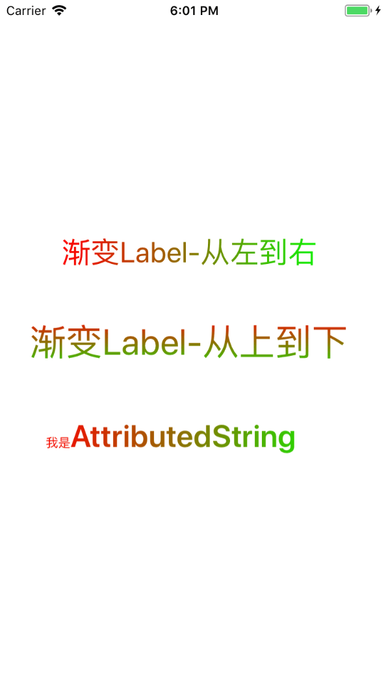

# ASGradientLabel
## 文字渐变Label
由于项目原因需要使用文字渐变，虽然可以使用`CAGradientLayer`来实现，但是由于项目为自动布局使用起来会比较麻烦，因此采取重写`drawRect`的方法。

参考自网上的方法，做了一点封装。

### 功能：
- 支持自动布局。
- 像`CAGradientLayer`设置渐变
- 支持设置`AttributedString`

示例：

